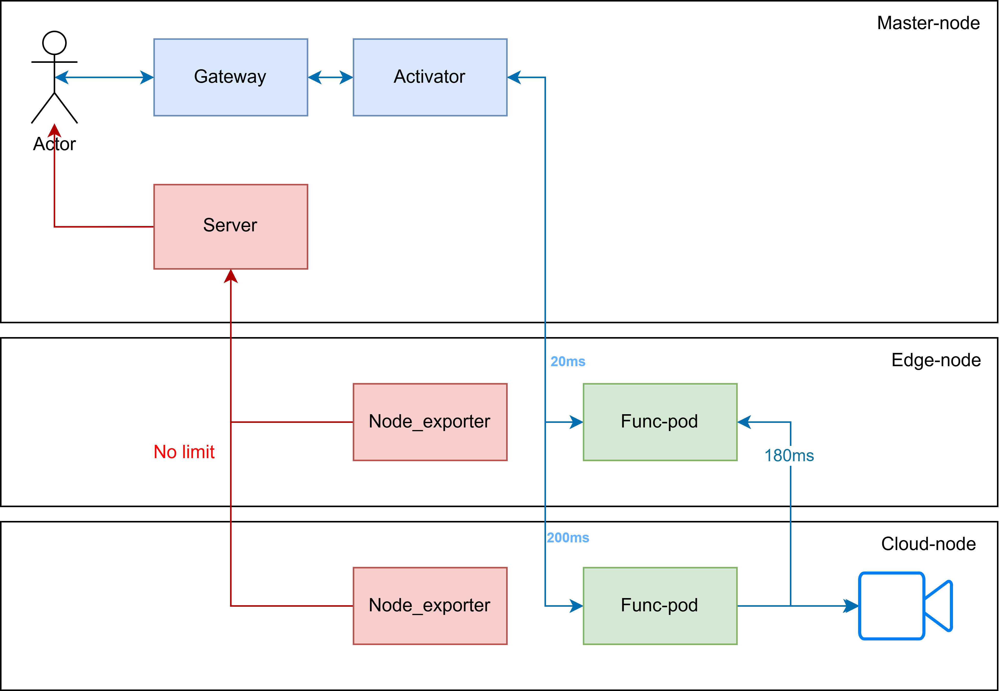

# Streaming configuration

## Testbed description



## Create streaming videos

```bash
ssh <cloud-node_usrname>@<cloud-node_ip> -t 'mkdir measurement'
scp -r config/setup/streaming <cloud-node_usrname>@<cloud-node_ip>:~/measurement/streaming
```

## Broadcast video at cloud-node

```bash
# At cloud-node
# Ensure you have install ffmpeg for video streaming on your device
apt install ffmpeg
# Start video streaming
cd measurement/streaming
chomod +x broadcast.sh
./broadcast.sh
```